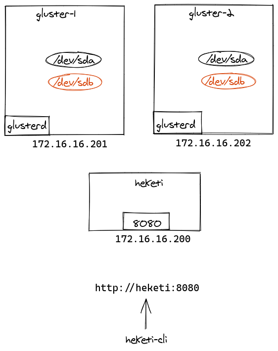

Glusterfs & Heketi CLuster
================================

Install & Configure Glusterfs & Heketi Cluster with Ansible in VM

Configured software and tools
------------
* Heketi v10.4.0-release-10
* Glusterfs 9.5

Heketi & Glusterfs cluster structure
------------

Basic settings
------------
* Installing and Configuring Glusterfs
* Installing and Configuring Heketi
* Creating cluster and adding nodes

Currently tested on these Operating Systems
* Linux/RHEL/CentOS 7

Requirements
------------
* Ansible 2.11.7

Dependencies
------------
* Copy Ansible control machine user's public SSH key (usually called id_rsa.pub) into the remote machine working directory
* Requires elevated root privileges
* Add hosts address and names for VMs : inventory
* Glusterfs nodes must have a 2nd sdb disk

Running the Deployment
----------------------

On the Ansible Control Machine  

__To deploy__

`./scripts/deploy.sh`

Author Information
------------------

Samir Nabadov
